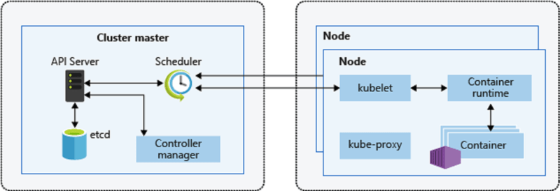

[](https://travis-ci.org/openmrs/openmrs-core) [](https://coveralls.io/github/openmrs/openmrs-core?branch=master) [](https://www.codacy.com/app/openmrs/openmrs-core?utm_source=github.com&amp;utm_medium=referral&amp;utm_content=openmrs/openmrs-core&amp;utm_campaign=Badge_Grade)

api: [](https://snyk.io/test/github/openmrs/openmrs-core?targetFile=api%2Fpom.xml)
test: [](https://snyk.io/test/github/openmrs/openmrs-core?targetFile=test%2Fpom.xml)
tools: [](https://snyk.io/test/github/openmrs/openmrs-core?targetFile=tools%2Fpom.xml)
web: [](https://snyk.io/test/github/openmrs/openmrs-core?targetFile=web%2Fpom.xml)
webapp: [](https://snyk.io/test/github/openmrs/openmrs-core?targetFile=webapp%2Fpom.xml)

OpenMRS is a patient-based medical record system focusing on giving providers a free customizable electronic medical record system (EMR).

The mission of OpenMRS is to improve health care delivery in resource-constrained environments by coordinating a global community that creates a robust, scalable, user-driven, open source medical record system platform.

#### Table of Contents

- [Build](#build)
  - [Prerequisites](#prerequisites)
    - [Java](#java)
    - [Maven](#maven)
    - [Git](#git)
  - [Build Command](#build-command)
  - [Deploy](#deploy)
- [Navigating the repository](#navigating-the-repository)
- [Software Development Kit](#software-development-kit)
- [Extending OpenMRS with Modules](#extending-openmrs-with-modules)
- [Documentation](#documentation)
  - [Developer guides](#developer-guides)
  - [Wiki](#wiki)
  - [Website](#website)
- [Contributing](#contributing)
  - [Code](#code)
  - [Code Reviews](#code-reviews)
  - [Translation](#translation)
- [Issues](#issues)
- [Community](#community)
- [Support](#support)
- [License](#license)
- [Now we write Dockerfile for openmrs project](#now-we-write-dockerfile-for-openmrs-project)
- [Next steps: Setting up Kubernetes cluster](#next-steps-setting-up-kubernetes-cluster)
  - [What is k8s and why do we use k8s](#what-is-k8s-and-why-do-we-use-k8s)
    - [K8s Cluster Architecture](#k8s-cluster-architecture)
    - [Why do we need Kubernetes](#why-do-we-need-kubernetes)
    - [Solutions for above Questions](#solutions-for-above-questions)
  - [Now we have to write the kubernetes object notations for openmrs deployments on k8s](#now-we-have-to-write-the-kubernetes-object-notations-for-openmrs-deployments-on-k8s)

## Build

### Prerequisites

#### Java

OpenMRS is a Java application which is why you need to install a Java JDK.

If you want to build the master branch you will need a Java JDK of minimum version 8.

#### Maven

Install the build tool [Maven](https://maven.apache.org/).

You need to ensure that Maven uses the Java JDK needed for the branch you want to build.

To do so execute

```bash
mvn -version
```

which will tell you what version Maven is using. Refer to the [Maven docs](https://maven.apache.org/configure.html) if you need to configure Maven.

#### Git

Install the version control tool [git](https://git-scm.com/) and clone this repository with

```bash
git clone https://github.com/openmrs/openmrs-core.git
```

### Build Command

After you have taken care of the [Prerequisites](#prerequisites)

Execute the following

```bash
cd openmrs-core
mvn clean package
```

This will generate the OpenMRS application in `webapp/target/openmrs.war` which you will have to deploy into an application server like for example [tomcat](https://tomcat.apache.org/) or [jetty](http://www.eclipse.org/jetty/).

### Deploy

For development purposes you can simply deploy the `openmrs.war` into the application server jetty via

```bash
cd openmrs-core/webapp
mvn jetty:run
```

If all goes well (check the console output) you can access the OpenMRS application at `localhost:8080/openmrs`.

Refer to [Getting Started as a Developer - Maven](https://wiki.openmrs.org/display/docs/Maven) for some more information
on useful Maven commands and build options.

## Navigating the repository

The project tree is set up as follows:

<table>
 <tr>
  <td>api/</td>
  <td>Java and resource files for building the java api jar file.</td>
 </tr>
 <tr>
  <td>tools/</td>
  <td>Meta code used during compiling and testing. Does not go into any released binary (like doclets).</td>
 </tr>
 <tr>
  <td>web/</td>
  <td>Java and resource files that are used in the webapp/war file.</td>
 </tr>
 <tr>
  <td>webapp/</td>
  <td>files used in building the war file (contains JSP files on older versions).</td>
 </tr>
 <tr>
  <td>pom.xml</td>
  <td>The main maven file used to build and package OpenMRS.</td>
 </tr>  
</table>

## Software Development Kit

For rapid development of modules and the OpenMRS Platform code check out the
awesome SDK at

https://wiki.openmrs.org/display/docs/OpenMRS+SDK

## Extending OpenMRS with Modules

OpenMRS has a modular architecture that allows developers to extend the OpenMRS core functionality by creating modules that can easily be added or removed to meet the needs of a specific implementation.

Before creating your own module go to the [OpenMRS Module Repository](https://addons.openmrs.org/) and see if there is already a module for your specific use case. If so deploy and try it and if a functionality is missing join the developers of the module to add a feature.

If you haven't found what you were looking for refer to the [Module - wiki](https://wiki.openmrs.org/display/docs/Modules) to learn how you can create a new module.

## Documentation

### Developer guides

If you want to contribute please refer to these resources

* [Getting Started as a Developer](https://wiki.openmrs.org/display/docs/Getting+Started+as+a+Developer)
* [How To Configure Your IDE](https://wiki.openmrs.org/display/docs/How-To+Setup+And+Use+Your+IDE)
* [How To Make a Pull Request](https://wiki.openmrs.org/display/docs/Pull+Request+Tips)

### Wiki

If you are looking for detailed guides on how to install, configure, contribute and
extend OpenMRS visit

http://wiki.openmrs.org

### Website

If you are looking for more information regarding OpenMRS as an organization
check

http://openmrs.org

## Contributing

Contributions are very welcome, we can definitely use your help!

OpenMRS organizes the privileges of its contributors in developer stages which
are documented [here](https://wiki.openmrs.org/display/RES/OpenMRS+Developer+Stages).

Read the following sections to find out where you could help.

### Code

Check out our [contributing guidelines](CONTRIBUTING.md), read through the [Developer guides](#developer-guides).

After you've read up :eyeglasses: [grab an introductory issue](https://wiki.openmrs.org/display/docs/Getting+Started+as+a+Developer) that is `Ready For Work`.

### Code Reviews

You might not have the time to develop yourself but enough experience with
OpenMRS and/or reviewing code, your help on code reviews will be much
appreciated!

Read

https://wiki.openmrs.org/display/docs/Code+Review

and get started with re-:eyes: pull requests!

### Translation

We use

https://www.transifex.com/openmrs/OpenMRS/

to manage our translations.

The `messages.properties` file in this repository is our single source of
truth. It contains key, value pairs for the English language which is the
default.

Transifex fetches updates to this file every night which can then be translated
by you and me on transifex website itself. At any time we can pull new translations from transifex
back into this repository. Other languages like for ex. Spanish will then be in
the `messages_es.properties` file.

If you would like to know how to help with translations see

http://openmrs.org/join-the-community/translate/

## Issues

If you want help fix existing issues or you found a bug and want to tell us please go to

https://issues.openmrs.org

## Community

[](http://talk.openmrs.org)
[![OpenMRS IRC](https://img.shields.io/badge/openmrs-irc-EEA616.svg?logo=data%3Aimage%2Fsvg%2Bxml%3Bbase64%2CPHN2ZyB4bWxucz0iaHR0cDovL3d3dy53My5vcmcvMjAwMC9zdmciIHdpZHRoPSI2MTIiIGhlaWdodD0iNjEyIiB2aWV3Qm94PSIwIDAgNjEyIDYxMiI%2BPHBhdGggZD0iTTE1MyAyMjkuNWMtMjEuMTMzIDAtMzguMjUgMTcuMTE3LTM4LjI1IDM4LjI1UzEzMS44NjcgMzA2IDE1MyAzMDZjMjEuMTE0IDAgMzguMjUtMTcuMTE3IDM4LjI1LTM4LjI1UzE3NC4xMzMgMjI5LjUgMTUzIDIyOS41em0xNTMgMGMtMjEuMTMzIDAtMzguMjUgMTcuMTE3LTM4LjI1IDM4LjI1UzI4NC44NjcgMzA2IDMwNiAzMDZjMjEuMTE0IDAgMzguMjUtMTcuMTE3IDM4LjI1LTM4LjI1UzMyNy4xMzMgMjI5LjUgMzA2IDIyOS41em0xNTMgMGMtMjEuMTMzIDAtMzguMjUgMTcuMTE3LTM4LjI1IDM4LjI1UzQzNy44NjcgMzA2IDQ1OSAzMDZzMzguMjUtMTcuMTE3IDM4LjI1LTM4LjI1UzQ4MC4xMzMgMjI5LjUgNDU5IDIyOS41ek0zMDYgMEMxMzcuMDEyIDAgMCAxMTkuODc1IDAgMjY3Ljc1YzAgODQuNTE0IDQ0Ljg0OCAxNTkuNzUgMTE0Ljc1IDIwOC44MjZWNjEybDEzNC4wNDctODEuMzRjMTguNTUyIDMuMDYyIDM3LjYzOCA0Ljg0IDU3LjIwMyA0Ljg0IDE2OS4wMDggMCAzMDYtMTE5Ljg3NSAzMDYtMjY3Ljc1UzQ3NS4wMDggMCAzMDYgMHptMCA0OTcuMjVjLTIyLjMzOCAwLTQzLjkxLTIuNi02NC42NDMtNy4wMmwtOTAuMDQgNTQuMTI0IDEuMjA0LTg4LjdDODMuNSA0MTQuMTMzIDM4LjI1IDM0NS41MTMgMzguMjUgMjY3Ljc1YzAtMTI2Ljc0IDExOS44NzUtMjI5LjUgMjY3Ljc1LTIyOS41czI2Ny43NSAxMDIuNzYgMjY3Ljc1IDIyOS41UzQ1My44NzUgNDk3LjI1IDMwNiA0OTcuMjV6IiBmaWxsPSIjZmZmIi8%2BPC9zdmc%2B)](http://irc.openmrs.org)
[![OpenMRS Telegram](https://img.shields.io/badge/openmrs-telegram-009384.svg?logo=data%3Aimage%2Fsvg%2Bxml%3Bbase64%2CPHN2ZyB4bWxucz0iaHR0cDovL3d3dy53My5vcmcvMjAwMC9zdmciIHZpZXdCb3g9IjAgMCAyNDAgMjQwIj48ZGVmcz48bGluZWFyR3JhZGllbnQgaWQ9ImEiIHgxPSIuNjY3IiB5MT0iLjE2NyIgeDI9Ii40MTciIHkyPSIuNzUiPjxzdG9wIHN0b3AtY29sb3I9IiMzN2FlZTIiIG9mZnNldD0iMCIvPjxzdG9wIHN0b3AtY29sb3I9IiMxZTk2YzgiIG9mZnNldD0iMSIvPjwvbGluZWFyR3JhZGllbnQ%2BPGxpbmVhckdyYWRpZW50IGlkPSJiIiB4MT0iLjY2IiB5MT0iLjQzNyIgeDI9Ii44NTEiIHkyPSIuODAyIj48c3RvcCBzdG9wLWNvbG9yPSIjZWZmN2ZjIiBvZmZzZXQ9IjAiLz48c3RvcCBzdG9wLWNvbG9yPSIjZmZmIiBvZmZzZXQ9IjEiLz48L2xpbmVhckdyYWRpZW50PjwvZGVmcz48Y2lyY2xlIGN4PSIxMjAiIGN5PSIxMjAiIHI9IjEyMCIgZmlsbD0idXJsKCNhKSIvPjxwYXRoIGZpbGw9IiNjOGRhZWEiIGQ9Ik05OCAxNzVjLTMuODg4IDAtMy4yMjctMS40NjgtNC41NjgtNS4xN0w4MiAxMzIuMjA3IDE3MCA4MCIvPjxwYXRoIGZpbGw9IiNhOWM5ZGQiIGQ9Ik05OCAxNzVjMyAwIDQuMzI1LTEuMzcyIDYtM2wxNi0xNS41NTgtMTkuOTU4LTEyLjAzNSIvPjxwYXRoIGZpbGw9InVybCgjYikiIGQ9Ik0xMDAuMDQgMTQ0LjQxbDQ4LjM2IDM1LjczYzUuNTIgMy4wNDQgOS41IDEuNDY3IDEwLjg3Ni01LjEyNGwxOS42ODUtOTIuNzYzYzIuMDE2LTguMDgtMy4wOC0xMS43NDYtOC4zNTgtOS4zNWwtMTE1LjU5IDQ0LjU3MmMtNy44OSAzLjE2NS03Ljg0NCA3LjU2Ny0xLjQ0IDkuNTI4bDI5LjY2NCA5LjI2IDY4LjY3My00My4zMjZjMy4yNC0xLjk2NiA2LjIxNy0uOTEgMy43NzUgMS4yNTgiLz48L3N2Zz4%3D)](https://telegram.me/openmrs)
[![OpenMRS Wiki](https://img.shields.io/badge/openmrs-wiki-5B57A6.svg?logo=data%3Aimage%2Fsvg%2Bxml%3Bbase64%2CPHN2ZyB4bWxucz0iaHR0cDovL3d3dy53My5vcmcvMjAwMC9zdmciIHdpZHRoPSIxNjAiIGhlaWdodD0iMTQyIiB2aWV3Qm94PSIwIDAgMTYwIDE0MiI%2BPHBhdGggY2xhc3M9InN0MCIgZD0iTTExMy42MTUgOTQuNDk0Yy0yLjAxNi0zLjk3NC00LjQwNS03Ljk5LTcuMi0xMi4wNzctMi0yLjkzLTQuMTQ1LTUuNzc4LTYuMzg3LTguNTY3LS45MS0xLjEzNi0uNTMtMi41NDguMTY3LTMuMjUuNjg4LS43MDUgMS4zOC0xLjQxIDIuMDc2LTIuMTIgOS41OC05Ljc3IDE5LjQ5LTE5Ljg3MyAyNy4wOS0zMC43ODcgOC4wOC0xMS42MSAxMi41Ni0yMi42MjQgMTMuNjktMzMuOTU0LjEyLTEuMTQtLjQtMi4zNS0xLjMyLTMuMDUtLjYtLjQ2LTEuMzMtLjctMi4wNy0uNy0uNDEgMC0uODIuMDctMS4yMS4yMi03LjM3IDIuODItMTQuODUgNC45Ni0yMS42OCA2LjU1LTEuMzkuMzItMi41MSAxLjM2LTIuOTggMi42LTQuOTggMTMuNjMtMTcuNjggMjYuNjEtMzEuMDEgNDAuMi0uNTMuNTEtMS4yOCAxLjE4LTIuNSAxLjE4cy0xLjk2LS42NS0yLjUtMS4xOGMtMTMuMzMtMTMuNTktMjYuMDMtMjYuNTItMzEtNDAuMTUtLjQ2LTEuMjQtMS41OS0yLjI4LTIuOTgtMi42QzM2Ljk0IDUuMjIgMjkuNDUgMi45IDIyLjEuMDhjLS4zOTgtLjE1LS44MS0uMjI1LTEuMjItLjIyNS0uNzQgMC0xLjQ3LjI0LTIuMDcuNy0uOTQuNzE4LTEuNDQgMS44NzItMS4zMiAzLjA0OCAxLjEzIDExLjMzMiA1LjYgMjIuNDggMTMuNjg0IDM0LjA5IDcuNiAxMC45MTUgMTcuNTEgMjEuMDE3IDI3LjA5IDMwLjc4NyAxNy42NSAxNy45OTQgMzQuMzMgMzQuOTk3IDM1Ljc5IDU0LjcxMy4xMyAxLjc4IDEuNjIgMy4xNTggMy40IDMuMTU4aDIwLjc0Yy45NCAwIDEuODMtLjM4IDIuNDctMS4wNi42NS0uNjcuOTktMS41OC45NC0yLjUyLS4xOC0zLjcxLS43Mi03LjQyLTEuNTktMTEuMTZoLjAxYy0uMDI4LS4xMS0uMDQ3LS4yMi0uMDQ3LS4zMyAwLS43NS41ODgtMS4zOCAxLjM1Ny0xLjM4LjA3IDAgLjEzLjAyLjIuMDMgMTYuOTMgMi40OCAyNy42MzYgNi40NCAyNy42NSAxMC44di4wMWMwIDQuMTEtOS42MjMgMTAuMzEtMjUuMjY2IDE0Ljg1bC0uMDA1LjAxYy0xLjM5LjQtMi40MDYgMS42Ni0yLjQwNiAzLjE1IDAgMS44MSAxLjQ5MyAzLjI4IDMuMzQgMy4yOC4yNTUgMCAuNS0uMDMuNzQtLjA4IDIxLjAyNi00Ljg2IDM0Ljk2NS0xMy4wMzQgMzQuOTY1LTIyLjI2MiAwLTEwLjk1NC0xOC44NC0yMC43NC00Ni45LTI1LjE1MnpNNTguMDEgODMuODA2Yy0uNDI1LS40NDQtMS4yNzctMS4wMzgtMi40MjItMS4wMzgtMS41NDcgMC0yLjQ2NiAxLTIuODEyIDEuNTMtMi4yNjQgMy40NDQtNC4yNCA2Ljg0My01Ljk0NiAxMC4yMDhDMTguODEgOTguOTI0IDAgMTA4LjcgMCAxMTkuNjVjMCA5LjIzNyAxMy44NCAxNy4zOTQgMzQuOTA1IDIyLjI1NS4wMDMuMDAyLjAyMyAwIC4wMyAwIC4yNS4wNTguNTA0LjA5NS43Ny4wOTUgMS44NDYgMCAzLjM0LTEuNDcgMy4zNC0zLjI4IDAtMS40ODctMS4wMTctMi43My0yLjQtMy4xM2wtLjAxLS4wMjJjLTE1LjY0NS00LjU0LTI1LjI3LTEwLjc0NC0yNS4yNy0xNC44NTJ2LS4wMWMuMDE3LTQuMzUzIDEwLjY5My04LjMwNiAyNy41OC0xMC43ODcuMDYyLS4wMS4xMi0uMDIuMTgyLS4wMi43NzUgMCAxLjM2OC42MyAxLjM2OCAxLjM5IDAgLjExLS4wMi4yMy0uMDQ2LjMzbC4wMS4wMWMtLjg3IDMuNzEtMS40IDcuNDEtMS41OCAxMS4xMS0uMDUuOTMuMjkgMS44NS45NCAyLjUzLjY0LjY3IDEuNTQgMS4wNiAyLjQ4IDEuMDZoMjAuNzRjMS43OCAwIDMuMjgtMS40IDMuNDEtMy4xNy40NS02LjA3IDIuMzUtMTIuMTUgNS43OC0xOC41NCAxLjE5LTIuMjEuMjYtNC4yOS0uNDItNS4xOC0zLjQyLTQuNDMtNy41OS05LjE2LTEzLjgxLTE1LjY1eiIgZmlsbD0iI2ZmZiIvPjxwYXRoIGNsYXNzPSJzdDAiIGQ9Ik03Ny44NjggMzIuNTc4Yy44Mi43OTggMS43NS45NDcgMi4zOS45NDdoLjAwNmMuNjQyIDAgMS41Ny0uMTQ4IDIuMzktLjk0NiA3LjMxMy03LjExIDExLjI0Mi0xNS40IDEyLjEwMy0xNy43MS4xMjUtLjM0LjI1Mi0uNzMuMjUyLTEuMjYgMC0xLjg0LTEuNTQtMy4xNi0zLjE0LTMuMTYtMS4zMyAwLTUuMS4zOS0xMS41OS4zOWgtLjA1Yy02LjUgMC0xMC4yNy0uMzktMTEuNTktLjM5LTEuNjEgMC0zLjE0IDEuMzEtMy4xNCAzLjE1IDAgLjUzLjEzLjkyLjI1IDEuMjYuODYgMi4zIDQuNzkgMTAuNTkgMTIuMSAxNy43eiIgZmlsbD0iI2ZmZiIvPjwvc3ZnPg%3D%3D)](https://wiki.openmrs.org)

## Support

Talk to us on [OpenMRS Talk](https://talk.openmrs.org/)

## License

[MPL 2.0 w/ HD](http://openmrs.org/license/) © [OpenMRS Inc.](http://www.openmrs.org/)

## Now we write Dockerfile for openmrs project

```Dockerfile
FROM maven:3-jdk-8 as mavenbuild
RUN git clone https://github.com/puru7791/openmrs-core.git && cd openmrs-core/ && mvn clean package

FROM tomcat:8
LABEL env="dev"
LABEL app="openmrs"
LABEL ver="0.1"
EXPOSE 8080
VOLUME /root/.OpenMRS
COPY --from=mavenbuild /openmrs-core/webapp/target/openmrs.war /usr/local/tomcat/webapps/openmrs.war
CMD ["catalina.sh", "run"]
```

* Now we will build the image for openmrs project by using docker commands

```bash
docker image build -t <dockerhub-name/image:tags> <Dockerfile-path>
```

* We need to push our image to [dockerhub](https://hub.docker.com/) before that you need to configure the login credentials 

```docker
docker login 
```

* To push our image to dockerhub Registry by following command

```docker
docker push <dockerhub-name/image:tags>
```

## Next steps: Setting up Kubernetes cluster

### What is k8s and why do we use k8s 

* Kubernetes is a platform that manages container-based applications, their networking and storage components.
* In Kubernetes, we focus on the application workloads rather than the underlying infrastructure.
* Kubernetes provides a declarative approach to deployments, backed by a rich set of APIs for management operations.
* Cluster: Cluster is collection of compute, storage and networking resources that Kubernetes uses to run workloads.
* Node: It is a single host. Now we can put the cluster as collection of nodes.
* Kubernetes has two kinds of Nodes
  * Master/Control plane:
    * Provides core Kubernetes Services and orchestration to application workloads
  * Nodes:
    * run your application workloads
  
#### K8s Cluster Architecture



#### Why do we need Kubernetes

* Containers are wonderful way of bundling and running your applications, But are they production ready?
* What would happen if container or the Docker Host goes down?
* How to make containers available 24*7?
* How to handle loads during peak time for the applications?
* How to replace containers without having downtime with new Docker Image based containers?
* How to monitor containers?

#### Solutions for above Questions

* Wouldn’t it be good if there is some system which can help for handling all the questions/concerns raised in above section. That exactly what Kubernetes does.
  * Kubernetes takes care of
    * Scaling requirements
    * failover
    * deployment patterns
  * Kubernetes Provides
    * Service Discovery & Load Balancing
    * Storage Orchestration
    * Automated rollouts and rollbacks
    * Automated bin packing
    * Self-Healing
    * Secret & Configuration Management
* Kubernetes is not only for the open source community embraced containers, It is deeply embraced by the Cloud Providers.
  * Amazon Web Service offers [Elastic Kubernetes Services(EKS)](https://docs.aws.amazon.com/eks/latest/userguide/getting-started.html)
  * Microsoft Azure offers [Azure Kubernetes Services(AKS)](https://docs.microsoft.com/en-us/azure/aks/kubernetes-walkthrough-portal)

### Now we have to write the kubernetes object notations for openmrs deployments on k8s

* Firstly we will write deployments, services, and K8s Ingress for our openmrs application
* I used azure storage for storing data and I claimed the bit of storage by writing Persistent VolumeClaim object file 
* Now create those obects by using kubernetes imperative commands

```bash
kubectl apply -f <manifest-file> 
```
* Next step we will be creating service files and I used service type as ClusterIP 
* In next step, we need to create Ingress resource file to avoid giving IP addresses to our client, before creating Ingress resource we need to install Nginx Ingress-controller

```bash
helm repo add ingress-nginx https://kubernetes.github.io/ingress-nginx
helm repo update

helm install ingress-nginx ingress-nginx/ingress-nginx

```
 